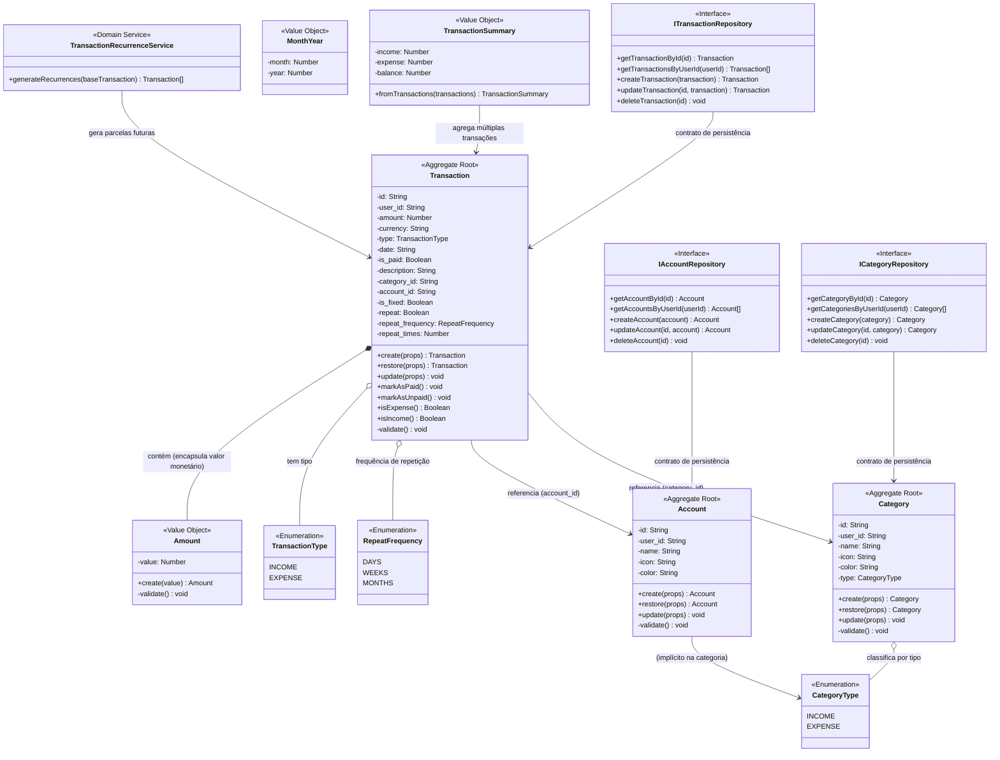

# Entrega Final do Projeto

## 1. Identificação do projeto

- Nome do projeto: Finance V2
- Integrantes do grupo: 
    - João Victor Ferreira Costa
    - Eville Vitória Nunes Coelho
    - Fernanda Galvão Marçal
- Link do repositório:
    ```text
    https://github.com/LCapistrano25/financeApp
    ```
    
- Tecnologia utilizada:

    - **Frontend & UI**
        - **Next.js 16 (App Router):** Estrutura de rotas e renderização híbrida.
        - **React 19:** Interface reativa e compatibilidade com App Router.
        - **TypeScript:** Segurança de tipos em todo o código e modelagem de domínio.
        - **Tailwind CSS v4 & Lucide React:** Estilização utilitária e iconografia.
        - **next-themes:** suporte a temas em nível de aplicação.

    - **Backend & Inteligência**
        - **Supabase:** PostgreSQL, autenticação e integração com o frontend via `@supabase/supabase-js` e `@supabase/auth-helpers-nextjs`.

    - **Qualidade & CI/CD**
        - **Jest & React Testing Library:** testes unitários e de integração para domínio, hooks, componentes e páginas.
        - **ESLint:** análise estática e padronização de código.
        - **SonarQube:** qualidade de código e métricas estáticas.
        - **GitHub Actions:** pipeline automatizada de integração contínua.

- Funcionalidade principal desenvolvida:

        Finance V2 é uma aplicação web focada em simplicidade e privacidade. Projetado especificamente para uso em dispositivos móveis, ele permite que você gerencie suas rendas e despesas diretamente do seu navegador.

## 2. Descrição do case

O Finance App é uma solução focada em simplicidade e privacidade para gerenciamento financeiro em dispositivos móveis. O sistema permite o controle centralizado de receitas e despesas, garantindo a integridade dos saldos, a correta categorização dos gastos e o controle atômico de transações financeiras, sejam elas únicas ou recorrentes.

## 3. Estado do projeto antes da análise externa

Antes da refatoração (Entregável 02), o projeto possuía uma estrutura em camadas, mas sofria de "Domínio Anêmico". Entidades como `Transaction`, `Account` e `Category` eram apenas interfaces TypeScript puras. As regras de negócio e os cálculos financeiros estavam concentrados na camada de aplicação, e havia um forte acoplamento com a infraestrutura (uso direto do cliente Supabase para recuperar sessões dentro dos handlers).

## 4. Alterações realizadas pelo outro grupo

O grupo avaliador trouxe melhorias focadas na robustez do domínio e no desacoplamento da infraestrutura:

* **Extração de Regras de Cálculo:** o cálculo de receitas, despesas e saldo foi isolado em `TransactionSummary`, tornando a regra de negócio explícita e reutilizável.
* **Isolamento da Autenticação:** a autenticação foi abstraída na aplicação por `IAuthService`, evitando vazamento de tipos e dependências do Supabase fora da infraestrutura.
* **Inversão de Dependência:** os casos de uso passaram a receber interfaces de repositório do domínio em vez de dependências concretas da infraestrutura.
* **Fortalecimento das Entidades:** `Transaction`, `Account` e `Category` deixaram de ser estruturas anêmicas e passaram a incluir fábricas, `restore()`, validações e comportamento encapsulado.
* **Value Object `Amount`:** o valor monetário foi protegido por um VO que valida finitude e positividade antes de ser usado pela entidade `Transaction`.
* **Contratos e repositórios para `Account` e `Category`:** além de `Transaction`, os agregados de conta e categoria ganharam contratos de persistência no domínio e implementações Supabase na infraestrutura.
* **Testes de domínio adicionados:** foram incluídas suítes de teste para VOs, entidades e casos de uso principais, garantindo proteção das regras de negócio e invariantes.

## 5. Avaliação das alterações recebidas

O grupo original avaliou as refatorações recebidas e decidiu integrá-las por serem consistentes com a estratégia de fortalecimento do domínio e de redução de acoplamento.

### Resultados aceitos e integrados:
* **Isolamento da autenticação:** o `SupabaseAuthService` foi mantido dentro da infraestrutura, enquanto a aplicação passou a depender da porta `IAuthService` e do tipo `AuthenticatedUser`.
* **Domínio rico:** as entidades `Transaction`, `Account` e `Category` deixaram de ser apenas estruturas de dados e passaram a encapsular comportamento, fábricas e validações internas.
* **Value Object `Amount`:** sua utilização no domínio protegeu o fluxo financeiro contra valores inválidos e garantiu invariantes aplicados localmente.
* **Cálculo de resumo financeiro centralizado:** `TransactionSummary` assumiu a responsabilidade única de agregar receitas, despesas e saldo, separando esse cálculo da apresentação e da persistência.
* **Contratos de persistência amplos:** a existência de interfaces de repositório para `Account`, `Category` e `Transaction` reforçou a inversão de dependência e a separação entre domínio e infraestrutura.
* **Testes automatizados:** os testes foram incorporados como proteção das regras de negócio, incluindo VOs, entidades e casos de uso.

### Comentário técnico:
As alterações são justificadas pela necessidade de proteger o núcleo de domínio do Finance App. Elas reduziram o acoplamento com Supabase e com a UI, ao mesmo tempo em que trouxeram validações explícitas para o domínio e maior cobertura por testes. Esse conjunto de mudanças tornou o código mais resiliente a alterações de infraestrutura e mais alinhado com princípios de DDD.

## 6. Melhorias adicionais realizadas pelo grupo original

Após estabilizar as alterações recebidas, o grupo original identificou que algumas diretrizes de modelagem ainda operavam de forma incompleta ou parcial. Implementamos as seguintes melhorias adicionais para garantir a conformidade estrita com os requisitos da disciplina:

* **Desenvolvimento do Domain Service `TransactionRecurrenceService`:** O relatório externo apontava que o sistema possuía campos e validações de recorrência, mas carecia de um mecanismo que gerasse de fato as parcelas futuras. Como uma transação individual não deve ter a responsabilidade de instanciar e gerenciar o ciclo de vida de outras transações (o que violaria suas fronteiras de consistência), extraímos essa regra para um Serviço de Domínio puro (`TransactionRecurrenceService`).
* **Orquestração Transacional de Recorrência no Caso de Uso:** Modificamos o `CreateTransactionUseCase` para consumir o novo serviço de domínio. Agora, quando uma transação base com a flag `repeat` ativa é persistida, o caso de uso intercepta o fluxo, invoca o `TransactionRecurrenceService.generateRecurrences()` e salva em lote (usando `Promise.all`) todas as parcelas herdeiras de forma atômica.
* **Sanitização de Inconsistências na Documentação:** Removemos todas as menções legadas a um "motor em Python/FastAPI" do `README.md`. Alinhamos os termos técnicos de "Handlers" para "Use Cases", refletindo fielmente a organização de arquivos atual do repositório.

## 7. Linguagem Ubíqua

* **Transação (Transaction):** Qualquer movimentação financeira registrada no sistema (paga, não-paga, recorrente ou avulsa).
* **Conta (Account):** Origem ou destino real dos fundos gerenciados pelo usuário.
* **Categoria (Category):** Classificação lógica atrelada a despesas ou receitas.
* **Recorrência (RepeatFrequency):** Regra de intervalo temporal ditando a repetição padronizada de transações geradas no futuro.

## 8. Módulos

O projeto organiza seus limites táticos através de uma rigorosa segregação por diretórios (camadas concêntricas):

* **Domain:** Contém as `entities`, `value-objects`, `enum`, `services` e os contratos de `repositories`. Totalmente agnóstico.
* **Application:** Casos de Uso (`usecases`) organizados por domínios secundários (`account`, `auth`, `category`, `transaction`) coordenando os fluxos.
* **Infrastructure:** Implementações físicas concretas de bancos de dados (`supabase`), `services` em nuvem e os mapeadores estruturais (`mappers`).
* **Presentation / App:** Elementos reativos (UI), páginas visuais, hooks assíncronos e componentes do React.

## 9. Entities

### Transaction

* **Identidade:** ID único gerado.
* **Responsabilidades:** Registrar transações, gerenciar datas, categorização e indicar pagamento.
* **Comportamentos:** `create()`, `restore()`, `update()`, `markAsPaid()`, `markAsUnpaid()`, `isExpense()`, `isIncome()`, `validate()`.
* **Regras de negócio:** A data deve ser válida; deve ser linkada ao UUID do proprietário (`user_id`); e se for recorrente, número de vezes e frequência são imperativos; o `amount` deve ser sempre válido.
* **Justificativa:** Entidade rica de negócio que muta durante o ciclo vital.

### Account

* **Identidade:** ID único.
* **Responsabilidades:** Definir as carteiras e cofres.
* **Comportamentos:** `create()`, `restore()`, `update()`, `validate()`.
* **Regras de negócio:** `name` e `user_id` são obrigatórios.
* **Justificativa:** Ciclo de vida independente (Criada antes da transação operar sobre ela).

### Category

* **Identidade:** ID único.
* **Responsabilidades:** Segmentar tipos lógicos de gasto/renda.
* **Comportamentos:** `create()`, `restore()`, `update()`, `validate()`.
* **Regras de negócio:** Só é possível inserir categoria dos tipos aceitos (EXPENSE ou INCOME).
* **Justificativa:** Identidade vital para as listagens e agregações financeiras do sistema.

## 10. Value Objects

### Amount

* **Atributos:** `value` (numérico encapsulado).
* **Validações:** Realiza a proteção "Fail-Fast" de que nenhum valor numérico no domínio possa nascer não-finito (ex: `NaN`) ou negativo (sendo igual ou menor a zero).
* **Critérios de igualdade:** Baseada em seu valor unitário.
* **Justificativa:** Impede que problemas clássicos com tipos flutuantes do Javascript ou corrupção de UI causem inserção de lixo matemático no banco de dados.

### TransactionSummary

* **Atributos:** `income`, `expense`, `balance`.
* **Validações:** O método `fromTransactions()` calcula totais apenas a partir de transações sinalizadas ativamente como `isPaid`.
* **Justificativa:** Encapsula o cálculo de totais, fornecendo um Side-Effect-Free Service robusto para dashboards e balanços.

## 11. Aggregates e Aggregate Roots

Neste cenário do escopo financeiro básico, atuamos com entidades singulares gerindo seus limites transacionais independentemente:

* **Transaction (Aggregate Root Central):** Protege suas variáveis internas (`isPaid`, recursividade e datas). Impede alterações de estado (invariantes) que fujam de chamadas aos seus métodos proprietários. Encapsula valores de domínio como `Amount`, enquanto o mapeamento para persistência fica a cargo dos mappers.
* **Account e Category:** Roots de configuração cadastradas de forma atômica no projeto e referenciadas indiretamente nas transações por chaves identificadoras.

## 12. Factories

Aplicadas pragmática e intrinsecamente dentro das Classes Concretas na forma de Estáticos (Static Members).

* Os métodos `create(props)` das entidades (`Transaction`, `Account`, `Category`) atuam formalmente como factories. Em vez de utilizar `new` diretamente, o código exige o `.create()`, que além do repasse atômico de tipagem, executa o `.validate()` imediatamente. Isso lança um erro em tempo de execução se as regras de domínio forem violadas. O mesmo padrão é usado em `.restore()` quando os Data Mappers reconstruem entidades a partir de dados persistidos.

## 13. Domain Services

* **TransactionRecurrenceService:** Implementado em `src/domain/services/transaction-recurrence.service.ts`. Ele gera parcelas futuras a partir de uma transação recorrente base, criando novos objetos `Transaction` com `is_paid: false` e com `repeat` desligado para evitar ciclos infinitos. O serviço calcula as datas das recorrências com base em `repeat_frequency` (`MONTHS`, `WEEKS`, `DAYS`).

## 14. Repositories

Todos blindados por "Inversão de Dependência".

* **Abstrações no Domínio:** Definem contratos para persistência e consulta, como `ITransactionRepository`, `IAccountRepository` e `ICategoryRepository`.
* **Forma:** Essas interfaces recebem e retornam instâncias de entidades (`Transaction`, `Account`, `Category`) em vez de tipos primitivos ou dados brutos.
* **Supabase (Infra):** A camada de infraestrutura implementa esses contratos com mapeamento de dados do Supabase para as entidades do domínio, mantendo o núcleo de negócio desacoplado da SDK externa.

## 15. Regras de negócio

| Regra de negócio | Classe responsável | Forma de proteção |
| --- | --- | --- |
| Valores financeiros lógicos (>0) | `Amount` (Value Object) | *Fail Fast*: Lança Erro caso nasça nulo ou negativo. |
| Dono real vinculado a contas/categorias | `CreateTransactionUseCase` e `EditTransactionUseCase` | Checagens de permissão explícitas validando igualdade entre a sessão de usuário e os dados da conta/categoria usados na transação. |
| Categorias incompatíveis barradas | `CreateTransactionUseCase` e `EditTransactionUseCase` | Validação rejeitando categorias `INCOME` sendo inseridas em formulários nativos de despesa (`EXPENSE`) e vice-versa. |
| Exigência de consistência na Recorrência | `Transaction` (Entity) | `.validate()` garantindo a presença simultânea de vezes/intervalo em transações com chave de repetição ativa. |
| Omissão do ciclo infinito na clonagem | `TransactionRecurrenceService` | Forçamento rígido de atributos de que herdeiras no tempo nasçam marcadas em falso para gerar filhos. |

## 16. Aplicação de Supple Design

A seção de *Supple Design* descreve como o modelo de domínio foi construído para ser natural ao uso e resistente a usos incorretos.

### Intention-Revealing Interfaces
As APIs do domínio foram nomeadas para refletir claramente o comportamento esperado. Métodos como `transaction.markAsPaid()`, `transaction.markAsUnpaid()`, `transaction.isExpense()` e `transaction.isIncome()` comunicam propósito diretamente, evitando que o consumidor precise manipular flags internas ou inferir significado a partir de dados primitivos.

### Side-Effect-Free Functions
O cálculo de totais financeiros foi isolado no `TransactionSummary.fromTransactions()` e no próprio Value Object `TransactionSummary`. Esse código é puro: recebe a coleção de transações pagas, reduz os valores e produz um novo resumo sem alterar o estado das entidades envolvidas.

### Assertions e Fail-Fast
As entidades e Value Objects protegem invariantes logo na criação. `Amount` valida positividade e finitude; `Transaction.validate()` verifica regras de recorrência, titularidade e data; `Account` e `Category` exigem identificadores e dados válidos. Essa abordagem impede que dados inválidos cheguem à infraestrutura.

### Conceptual Contours
O domínio recebeu contornos conceituais explícitos para separar tipos primitivos de significado de negócio. `Amount` encapsula a semântica financeira do valor numérico, enquanto `MonthYear` e `RepeatFrequency` formalizam conceitos de período e recorrência. Assim, cada conceito permanece coeso e fácil de entender.

## 17. Arquitetura final

O Finance App adota uma estrutura inspirada em **Clean Architecture** e em princípios de **DDD**. O código está organizado em camadas com dependência direcionada para dentro, de fora para o núcleo de domínio.

### Visão geral da arquitetura

* O `src/app/` contém a entrega externa do Next.js: rotas, layouts e componentes de página.
* O `src/presentation/` contém a interface de usuário e os hooks que adaptam o estado da UI para os casos de uso.
* O `src/application/` contém os casos de uso e as portas necessárias para orquestrar operações de negócio.
* O `src/infrastructure/` contém implementações concretas de persistência, autenticação e mapeamento de dados.
* O `src/domain/` contém as regras de negócio puras, entidades, value objects, serviços de domínio e contratos de repositório.

### Camadas e responsabilidades

**1. Domain (`src/domain/`)**

* **Responsabilidade:** Núcleo agnóstico. Define regras de negócio, invariantes e vocabulário do domínio.
* **Conteúdo:**
  * `entities/` — classes de domínio ricas como `Transaction`, `Account` e `Category`.
  * `value-objects/` — objetos de valor como `Amount` e `TransactionSummary`.
  * `services/` — serviços de domínio puros, como `TransactionRecurrenceService`.
  * `enum/` — tipos de domínio (`TransactionType`, `RepeatFrequency`).
  * `repositories/` — contratos de persistência (`ITransactionRepository`, `IAccountRepository`, `ICategoryRepository`).

**2. Application (`src/application/`)**

* **Responsabilidade:** Orquestrar fluxos de uso e coordenar as conversas entre a interface e o domínio.
* **Conteúdo:**
  * `usecases/` — casos de uso agrupados por subdomínio (`account`, `auth`, `category`, `transaction`).
  * `ports/` — abstrações de infraestrutura ou serviços externos, como `IAuthService`.

**3. Infrastructure (`src/infrastructure/`)**

* **Responsabilidade:** Implementar detalhes técnicos e integrações externas.
* **Conteúdo:**
  * `repositories/supabase/` — repositórios que usam Supabase para persistência.
  * `services/` — implementações de serviços concretos, como `supabase-auth.service.ts`.
  * `mappers/` — conversão entre dados brutos do Supabase e as entidades de domínio.

**4. Presentation (`src/presentation/`)**

* **Responsabilidade:** Isolar a UI e o estado de apresentação das regras de negócio.
* **Conteúdo:**
  * `components/` — componentes visuais reutilizáveis.
  * `hooks/` — adaptadores que conectam a UI aos casos de uso.
  * `lib/` — utilitários de suporte usados pela camada de apresentação.

**5. App / UI (`src/app/`)**

* **Responsabilidade:** Ponto de entrada do Next.js, roteamento e renderização de páginas.
* **Conteúdo:**
  * rotas e layouts do App Router.
  * páginas que consomem componentes e hooks da camada de `presentation`.

### Padrão de dependência

* A camada externa depende da camada imediatamente interna.
* `src/app/` depende de `src/presentation/`.
* `src/presentation/` depende de `src/application/` e dos contratos de `src/domain/`.
* `src/application/` depende de `src/domain/` e de portas como `IAuthService`.
* `src/infrastructure/` depende de `src/domain/` para fornecer implementações concretas aos contratos.
* O domínio permanece livre de dependências de infraestrutura ou da UI.

### Justificativa

Essa organização garante que as regras de negócio fiquem centralizadas e testáveis, enquanto os detalhes de framework e persistência permanecem isolados. A arquitetura torna o projeto mais resistente a mudanças em UI, autenticação ou banco de dados, mantendo o núcleo de domínio estável.

## 18. Diagrama do modelo de domínio

Abaixo está a representação visual do *Core Domain* do Finance V2, evidenciando os Agregados, Entidades, Objetos de Valor, Serviços de Domínio e os Contratos de Persistência.

### Visão geral da estrutura de domínio



### Organização do Domínio

- **Agregados:** `Transaction`, `Account` e `Category` funcionam como raízes de agregados independentes, cada uma gerenciando seu próprio ciclo de vida e validações.
- **Objetos de Valor:** `Amount`, `TransactionSummary` e `MonthYear` encapsulam conceitos do negócio, protegendo invariantes e fornecendo operações sem efeitos colaterais.
- **Enumerações:** `TransactionType`, `RepeatFrequency` e `CategoryType` formalizam os tipos permitidos no domínio.
- **Serviços de Domínio:** `TransactionRecurrenceService` orquestra a lógica de geração de parcelas recorrentes, que não pertence a uma única entidade.
- **Portas (Contratos):** `ITransactionRepository`, `IAccountRepository` e `ICategoryRepository` definem os contratos que a infraestrutura deve implementar, garantindo inversão de dependência.

## 19. Testes e validações realizadas

* **Execução de testes:** O projeto usa `Jest` para testes unitários e de integração, acionados por `npm run test` e cobertura por `npm run test:coverage`.
* **Domínio:** existem suítes de teste para os Value Objects (`Amount`, `TransactionSummary`, `MonthYear`), as entidades (`Transaction`, `Account`, `Category`) e os serviços de domínio (`TransactionRecurrenceService`).
* **Application:** há testes de casos de uso de transação, conta, categoria e autenticação, incluindo criação, edição, exclusão, listagem e login/logout.
* **Infrastructure:** o serviço de autenticação do Supabase e os repositórios concretos de `transaction`, `category` e `account` possuem validações automatizadas.
* **Presentation / UI:** a camada de apresentação é coberta por testes de hooks, componentes reutilizáveis, forms, páginas e rotas do Next.js.
* **Validações:** os testes confirmam as invariantes de domínio, proteções *Fail-Fast*, as regras de recorrência e o comportamento esperado dos principais fluxos de negócio.

## 20. Instruções para execução

Siga os passos abaixo para clonar, configurar, testar e executar a versão consolidada e definitiva do Finance App em seu ambiente de desenvolvimento local:

### 1. Pré-requisitos
Certifique-se de possuir instalado em sua estação de trabalho:
* Node.js (versão `>= 18.x` recomendada)
* npm (versão `>= 9.x`)

### 2. Instalação de Dependências
Navegue até o diretório raiz do projeto e instale os pacotes necessários:
```bash
npm install
```

### 3. Configuração do Ambiente

Crie um arquivo `.env` na raiz do projeto com base no arquivo de exemplo existente.
Abra o arquivo `.env` e insira as credenciais do seu projeto do Supabase e as configurações de porta local:

```env
NEXT_PUBLIC_SUPABASE_URL=[https://seu-projeto.supabase.co](https://seu-projeto.supabase.co)
NEXT_PUBLIC_SUPABASE_ANON_KEY=sua-chave-anonima-aqui
NEXT_PUBLIC_AUTH_REDIRECT_URL=http://localhost:3000/auth/callback
```

### 4. Execução dos Testes Automatizados

Para rodar toda a suíte de testes unitários e de integração do domínio e da aplicação, garantindo que todas as regras de DDD estão passando com sucesso, execute:

```bash
npm run test
```

### 5. Execução do Servidor de Desenvolvimento

Inicie o servidor local do Next.js:

```bash
npm run dev
```

Após o build inicial, abra o seu navegador e acesse a URL:

```text
http://localhost:3000
```

## 21. Limitações e trabalhos futuros

* **Cobertura de testes de integração:** o projeto possui boa cobertura unitária e de componentes, mas ainda pode ser fortalecido com testes de integração que validem o fluxo completo entre UI, casos de uso e infraestrutura Supabase.
* **Gerenciamento avançado de recorrência:** embora exista `TransactionRecurrenceService`, a evolução natural inclui regras para edição/exclusão de séries recorrentes, ajuste de parcelas e normalização de transações históricas.
* **Relatórios e histórico financeiro:** o sistema ainda não possui painéis analíticos avançados nem relatórios históricos ricos, que seriam relevantes para um produto financeiro completo.
* **Modularidade por domínio:** a estrutura atual é por camadas; se o sistema crescer, vale a pena evoluir para uma organização por bounded contexts ou módulos de domínio para melhorar a escalabilidade e a manutenção.
* **Feedback de erro e UX de validação:** a aplicação deve seguir evoluindo a experiência de validação na interface, exibindo mensagens claras para as regras de domínio que já são garantidas no backend.

## 22. Conclusão

A evolução do Finance App ao longo dos três entregáveis reflete uma jornada de maturidade arquitetural e aprofundamento técnico. No Entregável 01, o projeto estabeleceu suas bases visuais e de produto (foco mobile, UI/UX), mas ainda pecava ao tratar o domínio apenas como um reflexo anêmico das tabelas do banco de dados, misturando regras de negócio com frameworks de apresentação e infraestrutura.

O Entregável 02 marcou o ponto de virada (*Refactoring to Deeper Insight*). Com a análise externa, compreendemos os perigos do acoplamento e a necessidade de isolar o coração do software. A introdução de Value Objects como o `Amount` e o `TransactionSummary` demonstrou na prática como encapsular primitivos e criar funções sem efeitos colaterais (*Side-Effect-Free Functions*), tornando o modelo mais seguro.

Neste Entregável 03, consolidamos a arquitetura. Blindamos as entidades (`Transaction`, `Account`, `Category`) aplicando métodos de fábrica e validações rígidas (*Fail-Fast*). Injetamos serviços de domínio puros, como o `TransactionRecurrenceService`, para orquestrar lógicas que transcendiam o escopo de uma única entidade, e aplicamos a inversão de dependência em sua totalidade com os repositórios. O resultado é um software que não apenas funciona, mas que expressa a linguagem ubíqua do domínio financeiro de forma clara, altamente testável e totalmente agnóstica à tecnologia de banco de dados ou interface visual utilizada.
